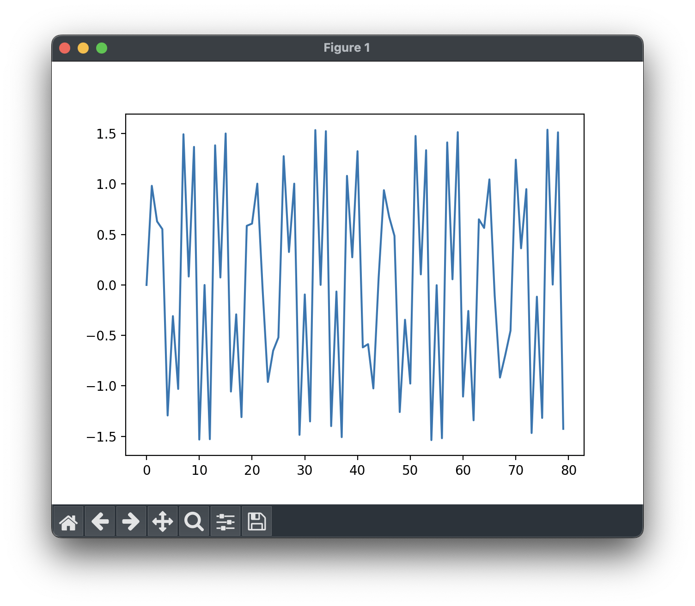

# Python FFT

푸리에 변환이죠. 사실 생기부 용입니다. 별거 없어요. 혹시나 수학적 기반을 응용한 프로젝트가 보고 싶으시다면 [https://github.com/testprocess/dft-js]() 레포를 참고해주세요. 여기선 라이브러리 일체 사용하지 않고 푸리에 변환을 구현했으니까. 적어도 공식을 보고 코드로 변환해낼 수는 있으니까요.

위 같은 그래프가

이것처럼 깔끔하게 분리되죠. 아름답지 않나요. 아. FFT는 고등학생이 이해할 수 없다고요? 맞아요. 이해할 수 없죠. 지금까지 배운 지식으론 증명하기 힘드니까요. 그럼에도 저는 공학을 기본 패러다임으로 몸담고 있는 사람입니다. 모든 세상을 공학으로 보죠. 즉, 우린 수학적 증명을 기반으로 새로운 세상을 창조하는 사람이란 뜻입니다. 생각해봐요 전셰게 소프트웨어 개발자들이 정말 그 기저에 깔린 지식을 다 알고 응용할까요?

솔직히 푸리에 변환..? 그거 공학에서는 기본입니다. 당장 이미지 압축에서도 활용되고 유튜브에도 활용되죠. 그 원리와 작동방식만 개괄적으로 알고 있어도 응용하는데 필요한 기반 지식을 다 가지고 있다고 생각합니다. 천재적인 폰 노이만 조차도 자신은 수학을 28%밖에 알지 못한다고 설명한 바 있죠. 배우기 시작한다면 끝이 없죠. 우리의 시간은 한정되어 있습니다. 그 시간에 선택과 집중을 하는게 인생에 도움이 되지 않을까요?

## 고등학교는 정말이지 지루해요

솔직히 응용하는데 필요한 기본 소양만 배울뿐 시간낭비라고 생각해요. 물론 가치 없다는건 아닙니다. 각자 필요한 지식이 있고 그에 맞게 찾아나서면 되니까요. 그래서 한 가지 제안을 하려고요. 파인만 테크닉이라고 아시나요? 우리가 무언가를 습득할때 머릿속에 집어넣는다고만 생각하는데 파인만 테크닉을 좀 다릅니다. 바로 집어넣음과 동시에 꺼내는 연습을 하는거죠. 

위 유튜브 영상에 잘 설명되어 있어요.

굳이 고등학교에서 무언갈 배우지 않아도 충분히 배울 수 있는 방법이 있습니다. 더 효율적이고요. 더 잘 이해됩니다. 

전 대한민국 교육을 부정하지 않습니다. 그렇다고 긍정하지도 않고요. 좋은 교육인가는 잘 모르겠습니다. 교육은 양날의 검과도 같거든요. 교육은 기반만 닦아놓으면 됩니다. 최소 교육이죠. 무튼 주류 이론은 아닙니다.

동시에 대학을 부정하지도 않습니다. 대졸자는 4년간의 노력을 우대받아야 하고 그에 따른 차등이 있어야 한다는 주의입니다. 그래서 저는 대학 1학년만 하고 중퇴하려고요. 언행 불일치라고요? 대학은 정말 필요한 사람이 가야하는 공간입니다. 취업, 연구, 유학 등 관련한 인프라가 있는 공간으로 가기 위해서는 반드시 넘어야할 징검다리 같은 셈이죠.

그리고 그 대학을 들어가기 위해 고등학교가 필요한 겁니다. 맙소사 모두에게 동일한 결과를 요구하네요. 신기하죠. 

## 좋아하는거 == 잘하는거 

운이 좋다고 느낍니다. 두 개가 같아서. 좋아하는걸 하면 덩달아 잘하게 됩니다. 하지만 잘하는걸 하면 좋아하는걸 할 수 없죠. 지루합니다.

고등학교 과정은 좋아하는걸 찾아가는 과정이고 대학 과정은 좋아하는걸 잘하게 되는 과정이라고 생각합니다. 아마 모든 사람이 이렇게 살고 있을거에요. 
